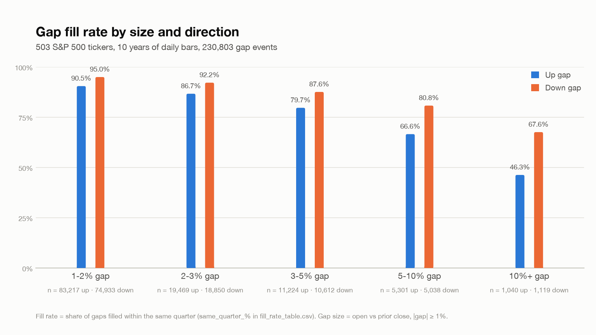

# gap-bot

Buy an S&P 500 stock after it gaps down 2% or more, once price trades back up to the gap-day open; sell when the gap fills at the prior close, at a per-bucket stop, or after 63 trading days. Ten years of daily-bar backtests and a paper-trading bot.



Share of gaps that fill within a quarter, by size and direction. 503 tickers, 230,803 gap events, 2016-09-06 to 2026-09-04 (measured 2026-09-05). Counts fills, not trades, so it does not depend on any entry rule.

## Thesis

A gap is a forced repricing on news, and I think the crowd over-reacts on the downside more than the upside because selling is fear-driven while buying is deliberate. If that holds, a down-gap in a large-cap name that starts to recover intraday is a mean-reversion setup with a clean shape: a defined target (the prior close) and a natural time limit (the gap fills or it does not). Two things have to be true for it to pay. The fill rate has to be high enough to cover the gaps that keep falling, and the failures must not all land on the same day.

## What I tested and what I learned

- **The trade is positive after conservative fills and friction.** Held-out two years, 2024-09-04 to 2026-09-04: +11.45%, max drawdown -14.59%, 174 trades, 64.4% win rate, 20 slots, 10 bps slippage per fill, 1-2% gaps excluded (measured 2026-09-08). Takeaway: the edge survives a fill rule that gives it nothing for free, but it is thin, so exposure decides whether it is worth running.
- **Down-gaps fill more reliably than up-gaps at every size.** Same-quarter fill rate and median days to fill, 10 years:

  | gap size | down, fills within a quarter | up, fills within a quarter | down, median days to fill |
  |---|---|---|---|
  | 1-2% | 95.0% | 90.5% | 1 |
  | 2-3% | 92.2% | 86.7% | 1 |
  | 3-5% | 87.6% | 79.7% | 2 |
  | 5-10% | 80.8% | 66.6% | 5 |
  | 10%+ | 67.6% | 46.3% | 10 |

  Takeaway: the downside asymmetry the thesis needs is there at every size, and the trade has a short median life.
- **Size is the signal.** Traded alone for 10 years with 20 slots, the 1-2% bucket returned -80.2% with an -82.7% max drawdown; the 10%+ bucket returned +196.3%. The config excludes 1-2% gaps (2026-09-07). Takeaway: a high fill rate is not an edge unless the fill is worth more than the friction.
- **Stops do not fix the risk, because the risk is correlated.** Across 110,544 trades over 10 years, every stop width lowered per-trade expectancy, monotonically: a 5% stop gave +0.08% per trade, a 30% stop +0.61%, no stop was best. In a 20-slot portfolio the max drawdown sat near -36% at every width, because panic days hit the whole book at once (250 names gapped down on 2020-03-27, 263 on 2020-04-01). The bot keeps per-bucket stops (7/11/16/26/37%) as a sanity limit only. Takeaway: the losses arrive together, so the answer is an exposure cap on the day, not a stop on the position.
- **Options are the wrong instrument for this trade.** On real option chains (2024-09-04 to 2026-09-04, buy at the ask, sell at the bid), all 15 long-call configurations (14 to 60 DTE by 0.3, 0.5 and 0.7 delta) lost; the best returned -0.41% of notional per trade against +50.1% for the same signals held as stock (2026-09-08). Debit spreads: 87 of 92 cells negative. Takeaway: the median hold is 6 days and the median loser runs 58, so theta on a short-window mean-reversion trade eats the edge.

## How it was tested

Data: the 503 current S&P 500 constituents, 10 years of daily OHLCV from yfinance (2016-09-06 to 2026-09-04, pulled 2026-09-05), 230,803 gap events of 1% or more. End-of-day option chains from ThetaData, 2024-09-04 to 2026-09-04.

Validation:
- The last two years are held out. Stop widths were derived on the first eight years and scored once on the held-out two. The 10-year figures are direction checks, not magnitudes.
- Fills: a resting limit order at the gap-day open, filled only where the day's low <= entry <= high, the most conservative reading a daily bar allows. Orders rest on the 20 largest gaps at the open, so the rule uses only what is known before the session starts.
- Friction: 10 bps slippage per fill, $0 commission. No position larger than 3% of 20-day average dollar volume.

Known gaps:
- Survivorship. Today's S&P 500 list projected 10 years back inflates the 10-year returns, which is why only the 2-year magnitude is quoted.
- Daily bars only. The order of intraday prices is unknown, so the fill rule assumes a resting order and nothing better.
- The 2-year window has served more than one check (stops, fill rule, slot count), so it is held out from the stop derivation, not from every choice.
- Stop widths and slot count come from 10-year per-trade statistics and have not been re-swept in the 2-year portfolio simulation. An early re-run suggests fewer slots do better (10 slots: +25.16%); not yet confirmed.
- No slippage stress above 10 bps on this fill rule. No dividends, borrow, or tax. 66 signals had no option chain and were dropped from the options study.

## Where it stands

Paused. The stock bot ran on paper from 2026-09-07 to 2026-09-12 and is stopped while the intraday fill logic is finished. Finished: the fill-rate, bucket, stop and slot studies, the held-out 2-year run, the options study, and a live engine that makes one decision per day after the close. Built but not deployed: long-call and call-spread variants of the engine, for a paper forward test beside the stock account. Open: whether 10 or 20 slots is right; what an exposure cap on panic days should look like, since the stop study pointed at that as the real risk control; and whether earnings gaps behave differently from news gaps. The next useful evidence is a few months of paper fills set against the backtest's fill assumption, which needs the intraday touch logic finished first; that and the exposure cap are what I would build next.

## What this is not

Paper trading only. Not investment advice. It does not claim a live edge, and no paper P&L is reported here, because a few weeks of fills prove nothing either way.

## How to run it

```
python -m venv .venv && .venv/bin/pip install pandas numpy pyarrow yfinance
.venv/bin/python scripts/download_bars.py    # 10 years of daily bars, resumable
.venv/bin/python scripts/analyze_gaps.py     # fill rates by bucket and direction
```

Every script under `scripts/` is standalone and reads the cached bars in `data/daily_bars/`; results land in `results/` as CSV. `live/run_daily.py` is the paper bot, on Schwab market data read-only, scheduled by the systemd unit in `deploy/`; `live/config.py` freezes the parameters above.

The files behind the numbers above: the held-out two-year result is the trade log `results/anchor_resting_limit_174_trades.csv`; the slot-count question is `scripts/slot_sweep_resting_limit.py` with its output in `results/slot_sweep_resting_limit.csv` (two years) and `results/slot_sweep_resting_limit_10yr.csv` (ten years, direction only); the options study is `scripts/backtest_long_call_real.py`, `scripts/debit_spread_real_backtest.py` and `scripts/debit_spread_real_scorecard.py`, with per-configuration scorecards in `results/long_call_real_scorecard.csv` and `results/debit_spread_real_scorecard.csv` and every trade in the matching `*_trades.csv`. The options scripts read end-of-day chains from a sibling `etf-bot/data/options/` store (set `ETF_BOT_DIR` to point elsewhere).

## Built with

Python 3, pandas, numpy, pyarrow. Daily bars from yfinance, option chains from ThetaData, live quotes from the Schwab market data API. Built with AI-assisted development (Claude Code); the research questions, hypotheses, validation choices, and conclusions are mine.
