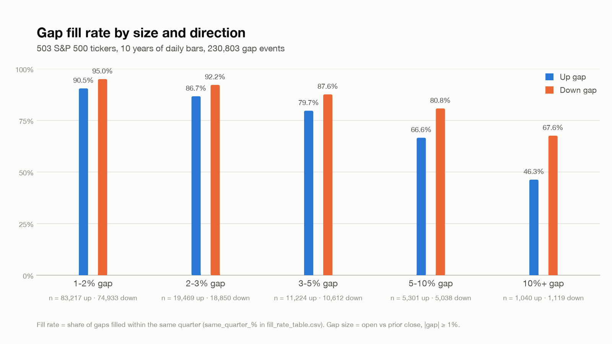

# gap-bot

Buy an S&P 500 stock after it gaps down 2% or more, once price trades back up to the gap-day open. Sell when the gap fills at the prior close, at a per-bucket stop, or after 63 trading days. Ten years of daily-bar backtests and a paper-trading bot.



Share of gaps that fill within a quarter, by size and direction. 503 tickers, 230,803 gap events, 2016-09-06 to 2026-09-04 (measured 2026-09-05). Counts fills, not trades, so it does not depend on any entry rule.

## Thesis

A gap is a forced repricing on news. I think the crowd over-reacts more on the downside than the upside, because selling is fear-driven and buying is deliberate. If that holds, a down-gap in a large-cap name that starts to recover intraday is a mean-reversion setup with a target (the prior close) and a time limit (the gap fills or it does not). For it to pay, enough gaps have to fill to cover the ones that keep falling, and the failures cannot all land on the same day.

## What I tested and what I learned

- **The trade is positive after conservative fills and friction.** Held-out two years, 2024-09-04 to 2026-09-04: +11.45%, max drawdown -14.59%, 174 trades, 64.4% win rate, 20 slots, 10 bps slippage per fill, 1-2% gaps excluded (measured 2026-09-08). The edge is thin. How much I put on decides whether it is worth running.
- **Down-gaps fill more reliably than up-gaps at every size.** Same-quarter fill rate and median days to fill, 10 years:

  | gap size | down, fills within a quarter | up, fills within a quarter | down, median days to fill |
  |---|---|---|---|
  | 1-2% | 95.0% | 90.5% | 1 |
  | 2-3% | 92.2% | 86.7% | 1 |
  | 3-5% | 87.6% | 79.7% | 2 |
  | 5-10% | 80.8% | 66.6% | 5 |
  | 10%+ | 67.6% | 46.3% | 10 |

  The asymmetry I need holds at every size, and most trades are over in days.
- **Small gaps lose, big gaps pay.** Traded alone for 10 years with 20 slots, the 1-2% bucket returned -80.2% with an -82.7% max drawdown; the 10%+ bucket returned +196.3%. I excluded 1-2% gaps from the config on 2026-09-07. Small gaps fill and still lose. The fill is worth less than the friction.
- **Stops do not help. The losses come together.** Across 110,544 trades over 10 years, each stop width I tried lowered per-trade expectancy, and tighter was worse: a 5% stop gave +0.08% per trade, a 30% stop +0.61%, and no stop was best. In a 20-slot portfolio the max drawdown sat near -36% at every width, because panic days hit the whole book at once (250 names gapped down on 2020-03-27, 263 on 2020-04-01). The bot keeps per-bucket stops (7/11/16/26/37%) as a sanity limit only. I want a cap on how much goes on in one day instead.
- **Options are the wrong instrument.** On real option chains (2024-09-04 to 2026-09-04, buy at the ask, sell at the bid), all 15 long-call configurations (14 to 60 DTE by 0.3, 0.5 and 0.7 delta) lost. The best returned -0.41% of notional per trade against +50.1% for the same signals held as stock (2026-09-08). Debit spreads: 87 of 92 cells negative. The median hold is 6 days and the median loser runs 58. Theta eats that.

## How it was tested

Data: the 503 current S&P 500 constituents, 10 years of daily OHLCV from yfinance (2016-09-06 to 2026-09-04, pulled 2026-09-05), 230,803 gap events of 1% or more. End-of-day option chains from ThetaData, 2024-09-04 to 2026-09-04.

Validation:
- I held out the last two years. I derived stop widths on the first eight and scored them once on the last two. The 10-year figures only tell me direction.
- Fills: a resting limit order at the gap-day open, filled only where the day's low <= entry <= high. That is the most conservative reading a daily bar allows. Orders rest on the 20 largest gaps at the open, so the rule uses only what I know before the session starts.
- Friction: 10 bps slippage per fill, $0 commission. No position larger than 3% of 20-day average dollar volume.

Known gaps:
- Survivorship. Today's S&P 500 list projected 10 years back inflates the 10-year returns, so I only quote the 2-year magnitude.
- Daily bars only. I do not know the order of intraday prices, so the fill rule assumes a resting order and nothing better.
- The 2-year window has served more than one check (stops, fill rule, slot count). I held it out from the stop derivation only.
- Stop widths and slot count come from 10-year per-trade statistics. I have not re-swept them in the 2-year portfolio simulation. An early re-run suggests fewer slots do better (10 slots: +25.16%). Not confirmed.
- No slippage stress above 10 bps on this fill rule. No dividends, borrow, or tax. 66 signals had no option chain, so I dropped them from the options study.

## Where it stands

Paused. The stock bot ran on paper from 2026-09-07 to 2026-09-12. I stopped it while I finish the intraday fill logic. I have finished the fill-rate, bucket, stop and slot studies, the held-out 2-year run, the options study, and a live engine that makes one decision per day after the close. I built long-call and call-spread versions of the engine but have not deployed them; they are for a paper forward test next to the stock account. I have not settled 10 slots versus 20. I have not designed the exposure cap on panic days, which the stop study says is the real risk control. I do not know whether earnings gaps behave differently from news gaps. The next evidence I want is a few months of paper fills against the backtest's fill assumption. That needs the intraday touch logic first. That and the exposure cap are what I would build next.

## What this is not

Paper trading only. Not investment advice. I do not claim a live edge, and I do not report paper P&L here, because a few weeks of fills prove nothing either way.

## How to run it

```
python -m venv .venv && .venv/bin/pip install pandas numpy pyarrow yfinance
.venv/bin/python scripts/download_bars.py    # 10 years of daily bars, resumable
.venv/bin/python scripts/analyze_gaps.py     # fill rates by bucket and direction
```

Each script under `scripts/` runs on its own and reads the cached bars in `data/daily_bars/`. Results go to `results/` as CSV. `live/run_daily.py` is the paper bot. It reads Schwab market data (read-only) and runs from the systemd unit in `deploy/`. `live/config.py` freezes the parameters above.

The files behind the numbers: the held-out two-year trade log is `results/anchor_resting_limit_174_trades.csv`. The slot-count question is `scripts/slot_sweep_resting_limit.py`, with output in `results/slot_sweep_resting_limit.csv` (two years) and `results/slot_sweep_resting_limit_10yr.csv` (ten years, direction only). The options study is `scripts/backtest_long_call_real.py`, `scripts/debit_spread_real_backtest.py` and `scripts/debit_spread_real_scorecard.py`. Per-configuration scorecards are in `results/long_call_real_scorecard.csv` and `results/debit_spread_real_scorecard.csv`, and each trade is in the matching `*_trades.csv`. The options scripts read end-of-day chains from a local ThetaData store that is not public; set `ETF_BOT_DIR` to your own copy.

## Built with

Python 3, pandas, numpy, pyarrow. Daily bars from yfinance, option chains from ThetaData, live quotes from the Schwab market data API. Built with AI-assisted development (Claude Code); the research questions, hypotheses, validation choices, and conclusions are mine.
